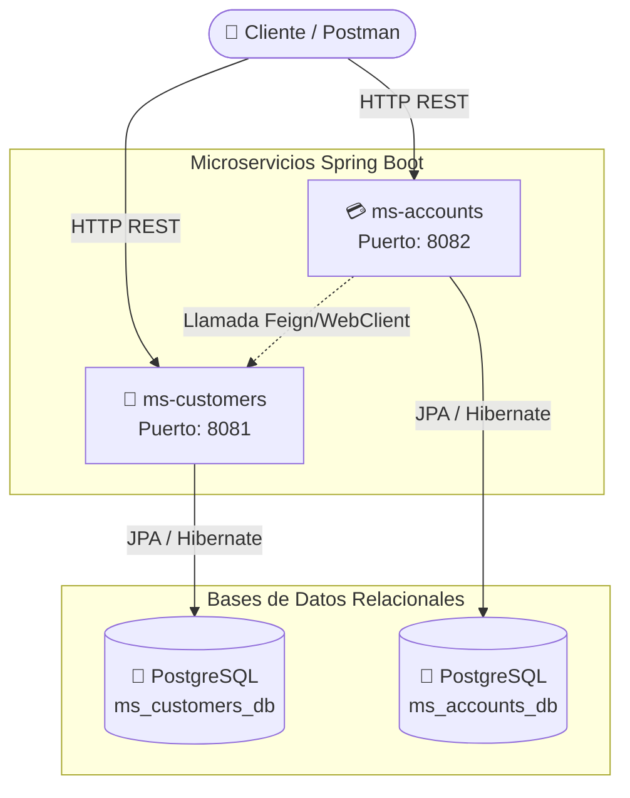
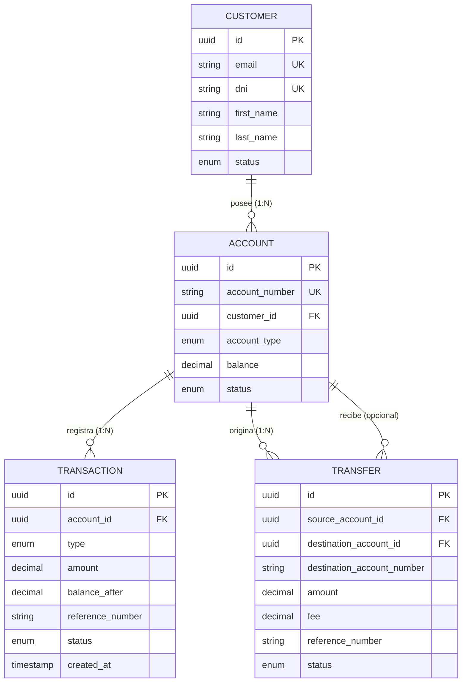

<h1 align="center">
  CodeBytes BankSystem
</h1>

<h4 align="center">Sistema de Gestión Bancaria basado en una Arquitectura de Microservicios</h4>

<p align="center">
  <a href="https://www.oracle.com/java/">
    
  </a>
  <a href="https://spring.io/projects/spring-boot">
    
  </a>
  <a href="https://www.postgresql.org/">
    
  </a>
  <a href="#">
    
  </a>
  <a href="#">
    
  </a>
  <a href="https://www.docker.com/">
    
  </a>
  <a href="#">
    
  </a>
</p>

---

## 📖 Acerca del Proyecto

**CodeBytes BankSystem** es un robusto sistema bancario diseñado con una **Arquitectura de Microservicios**. La solución está dividida en dos componentes principales:
1. **`ms-customers`** 👤: Responsable de la Gestión de Identidad, Perfil de Usuario, y Seguridad (Autenticación + Autorización con JWT).
2. **`ms-accounts`** 💳: Encargado del manejo de Cuentas Bancarias y Transacciones (Depósitos, Retiros, Consultas).

Ambos servicios se comunican internamente de forma segura para validar la autorización de un cliente antes de procesar cualquier operación financiera, garantizando fiabilidad e integridad de los datos.

## 🏗 Arquitectura del Sistema

A continuación, se detalla la arquitectura general de los microservicios, bases de datos, y el flujo de comunicación, donde cada servicio gestiona su propia base de datos (PostgreSQL):



## 📊 Modelo de Datos (ER Diagram)

La persistencia del sistema se basa en el siguiente modelo de entidades y relaciones:



## 🚀 Estado del Proyecto (Sprints Sucesivos)

El proyecto se desarrolla bajo metodología ágil a través de Historias de Usuario (HU). A continuación, el avance actual de las funcionalidades básicas y complejas:

- [x] **HU-01** - Registro de Cliente
- [x] **HU-02** - Autenticación (Login / JWT)
- [x] **HU-03** - Perfil de Cliente
- [x] **HU-04** - Validar existencia y estado de cliente (comunicación interna)
- [x] **HU-05** - Crear cuenta bancaria
- [x] **HU-06** - Listar cuentas asociadas al cliente
- [x] **HU-07** - Consultar detalle de una cuenta específica
- [x] **HU-08** - Depósito en cuenta local
- [x] **HU-09** - Retiro de cuenta local
- [x] **HU-10** - Transferencia entre cuentas propias / terceros
- [x] **HU-11** - Consultar historial completo de transacciones
- [x] **HU-12** - Resiliencia y Manejo de errores entre microservicios (Circuit Breaker)

## 📂 Estructura del Código Fuente

El repositorio está organizado como un proyecto multi-módulo de Maven para modularizar y desacoplar responsabilidades correctamente:

```text
bank-management-system/
├── ms-customers/            # Gestión de Clientes, Usuarios, Roles y Token (JWT)
│   └── src/main/java/com/codebytes5/banking/customers/
│      ├── config/
│      ├── controller/
│      ├── dto/
│      ├── enums/
│      ├── exception/
│      ├── mapper/
│      ├── model/
│      ├── repository/
│      ├── security/
│      └── service/
├── ms-accounts/             # Lógica de Negocio Central de Banca
│   └── src/main/java/com/codebytes5/banking/accounts/
│      ├── client/
│      ├── config/
│      ├── controller/
│      ├── dto/
│      ├── enums/
│      ├── exception/
│      ├── mapper/
│      ├── model/
│      ├── repository/
│      └── service/
├── docker-compose.yml       # Orquestador local de BDD (Postgres) y herramientas (Adminer, Dozzle)
├── init-user-db.sh          # Scripts iniciales de Base de Datos
└── BankSystem.postman_collection.json # Suite de Pruebas de API Completa
```

## 🛠 Entorno y Stack Tecnológico


- **Lenguaje**: Java 17
- **Framework**: Spring Boot 3.5.10
- **Seguridad**: Spring Security + BCrypt
- **Base de Datos**: PostgreSQL (una instancia por microservicio)
- **Documentación**: OpenAPI 3.0 (Swagger UI)
- **Herramientas**: Docker, Maven, Lombok, MapStruct

---

## 🏁 Pasos Básicos Para Empezar (Getting Started)

### 1. Requisitos Previos

Necesitarás las siguientes herramientas instaladas para poder contribuir y ejecutar el proyecto:
- **[Java 17+](https://www.oracle.com/java/technologies/javase/jdk17-archive-downloads.html)**
- **[Docker](https://docs.docker.com/engine/install/)** y **Docker Compose**
- **[Maven](https://maven.apache.org/)** (se incluye el wrapper `mvnw` en el root del proyecto)

### 2. Despliegue de Bases de Datos y Herramientas (Vía Docker)

Antes de levantar los microservicios Java, asegúrate de levantar las BD. 
Crea el archivo `.docker/.env.development` y configura las credenciales de PostgreSQL:

```env
POSTGRES_USER=admin
POSTGRES_PASSWORD=admin
```

Desde la raíz del proyecto, ejecuta el siguiente comando:

```bash
docker compose up -d db dozzle
```

> 💡 **Nota:** <br>
> - Visita [http://localhost:9999](http://localhost:9999) para acceder a **Dozzle**, lo que te permitirá inspeccionar los logs de tus contenedores Docker en tiempo real. <br>
> - Puedes usar Adminer para manipular la BD visualmente: `docker compose up -d adminer` y entrar en [http://localhost:8080](http://localhost:8080).

#### *(Opcional)* Conexión CLI a Postgres
```bash
docker exec -it postgres-databases psql -U admin
```

*(Opcional) Detención de los servicios: `docker compose down -v` o `docker compose down`.*

### 3. Ejecución de los Microservicios

Es necesario disponer de variables de entorno para la configuración de cada microservicio en la sub-carpeta correspondiente.

#### Configuración ms-customers/.env
```properties
CUSTOMERS_SERVER_PORT=8081
POSTGRES_USER=admin
POSTGRES_PASSWORD=admin
POSTGRES_HOST=localhost
POSTGRES_PORT=5432
POSTGRES_DB_CUSTOMERS=customers_db
```

#### Configuración ms-accounts/.env
```properties
ACCOUNTS_SERVER_PORT=8082
POSTGRES_USER=admin
POSTGRES_PASSWORD=admin
POSTGRES_HOST=localhost
POSTGRES_PORT=5432
POSTGRES_DB_ACCOUNTS=accounts_db
```

#### Correr Localmente Cada Servicio Individual (usando Maven)
En terminales separadas, corre:
```bash
# Windows
./mvnw -pl ms-customers spring-boot:run
./mvnw -pl ms-accounts spring-boot:run

# Linux / Mac OS
mvn -pl ms-customers spring-boot:run
mvn -pl ms-accounts spring-boot:run
```

---

### Guía de Uso Rápido en Postman:
1. Importa `BankSystem.postman_collection.json`.
2. Ejecuta dentro del Fólder Auth → **Register Customer**.
3. Ejecuta **Login Customer**. (Postman interceptará el token JWT y lo dejará disponible globalmente para las siguientes llamadas).
4. Ejecuta el End-Point de creación y consulta de Cuentas usando el Fólder de Accounts.
5. Usa los End-Points de Depósito y Retiro (`deposit`/`withdraw`) pasando la información requerida.


## 📖 Documentación de API (OpenAPI 3)

Ambos microservicios generan documentación viva e interactiva por medio de Swagger-UI. 

No es necesario usar herramientas de terceros para ver los contratos de red de REST; basta con acceder desde el navegador local e introducir el token devuelto por el *Login* dentro del formulario `Authorize`.

- **Swagger de ms-customers**: [http://localhost:8081/swagger-ui/index.html](http://localhost:8081/swagger-ui/index.html)
- **Swagger de ms-accounts**: [http://localhost:8082/swagger-ui/index.html](http://localhost:8082/swagger-ui/index.html)

---

> Sistema de Gestión Bancaria - Arquitectura de Microservicios

> Equipo 05 - CodeBytes.